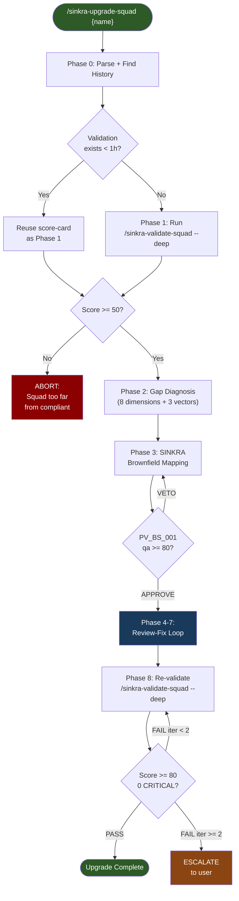
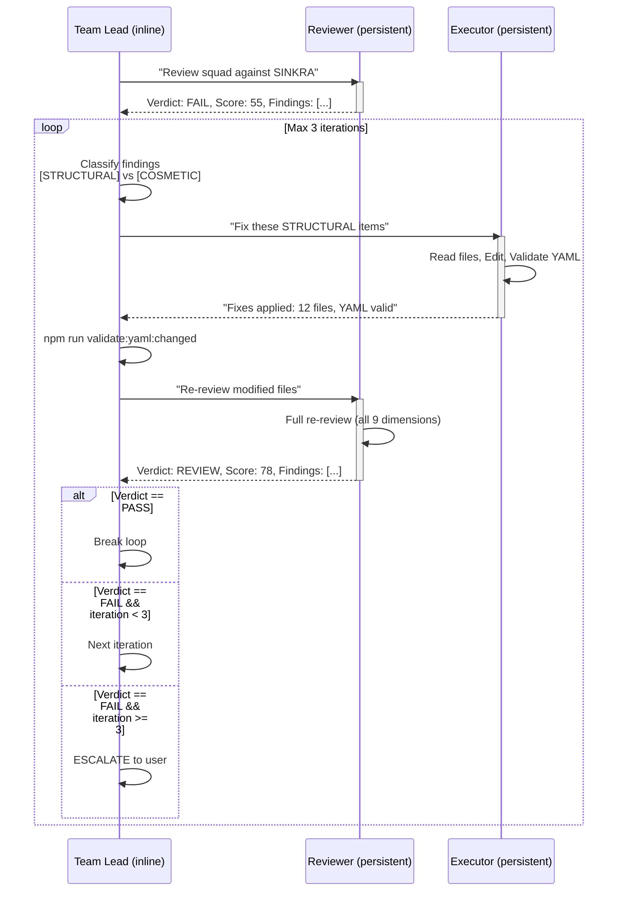
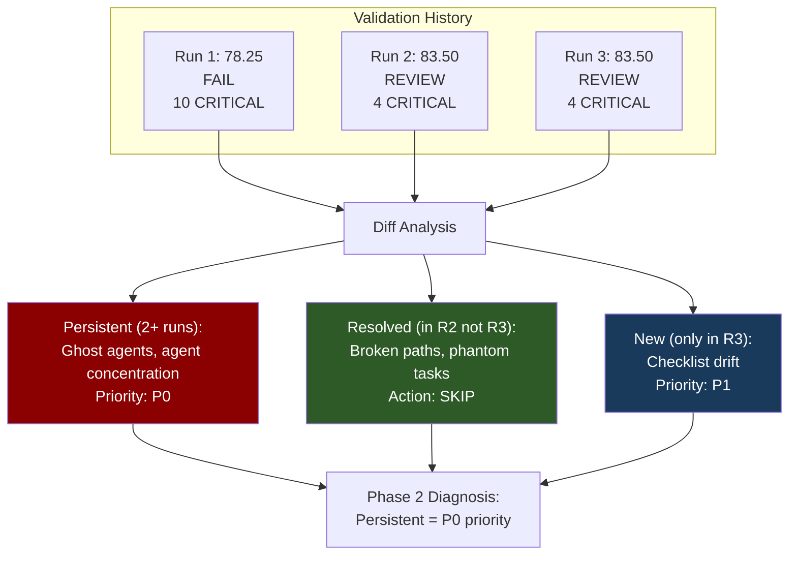
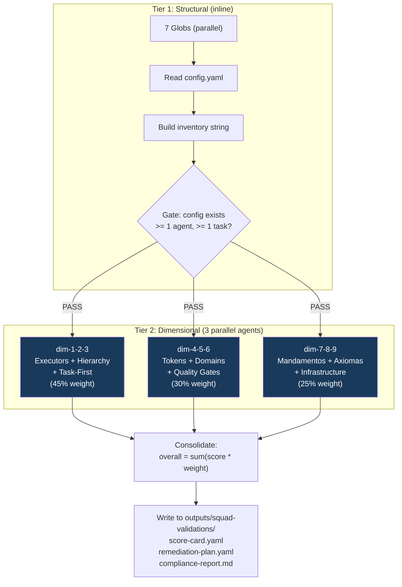
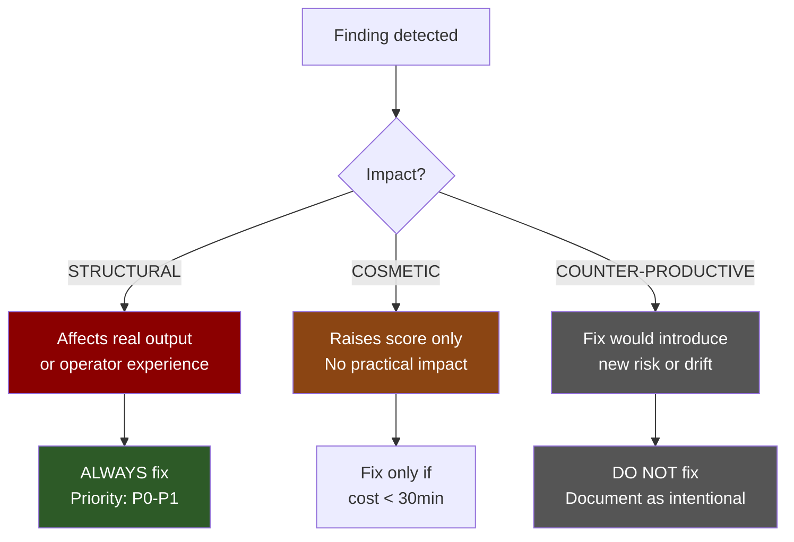
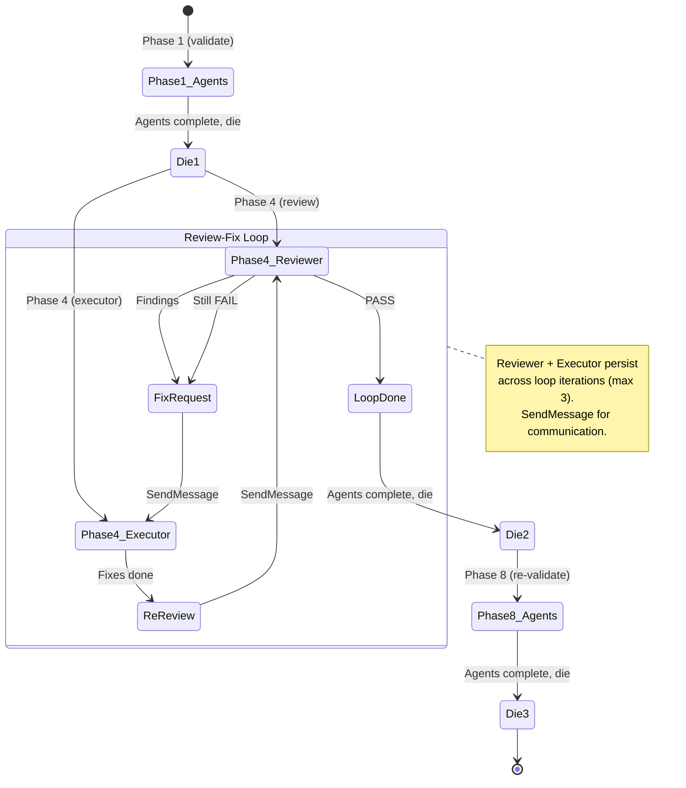
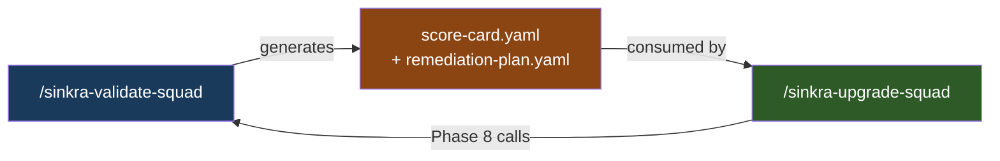
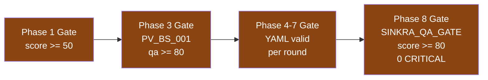

# /sinkra-upgrade-squad — SINKRA-Native Squad Upgrade

Transforms a SINKRA-compliant squad into a SINKRA-native squad via 8-phase pipeline with review-fix loop.

## Quick Start

```bash
/sinkra-upgrade-squad movement          # Full upgrade (default — all waves, all phases)
/sinkra-upgrade-squad spy --wave 2      # Resume from wave 2 (rare)
/sinkra-upgrade-squad db-sage --scope token_bridge  # Only token upgrade vector
```

## Pipeline Overview



## Phase 4-7: Review-Fix Loop (QG Pattern)

The core of the upgrade. Two persistent agents (Reviewer + Executor) iterate until PASS or circuit breaker (3 rounds).



## Full Phase Architecture

```mermaid
graph LR
    subgraph "Phase 0: Setup"
        P0A["Parse args"] --> P0B["Find validation history<br/>(last 3 runs)"]
        P0B --> P0C["Classify scale<br/>(small/large)"]
        P0C --> P0D["Display banner"]
    end

    subgraph "Phase 1: Assessment"
        P1A{"Recent<br/>validate?"}
        P1A -->|Yes| P1B["Reuse score-card"]
        P1A -->|No| P1C["Run /sinkra-validate-squad<br/>3 parallel agents"]
        P1C --> P1D["score-card.yaml<br/>+ remediation-plan.yaml"]
        P1B --> P1E["Gate: score >= 50"]
        P1D --> P1E
    end

    subgraph "Phase 2: Diagnosis"
        P2A["Analyze 8 dimensions"] --> P2B["Define 3 upgrade vectors<br/>V1: Pipeline<br/>V2: Tokens<br/>V3: Composition"]
        P2B --> P2C["Heuristic checks<br/>(AN_KE_085, PV_PA_028, etc)"]
        P2C --> P2D["Prioritize:<br/>persistent > new > resolved"]
    end

    subgraph "Phase 3: Mapping"
        P3A["Brownfield *map-process"] --> P3B["7-phase SINKRA pipeline"]
        P3B --> P3C["Checkpoint PV_BS_001<br/>qa >= 80"]
    end

    subgraph "Phase 4-7: Review-Fix Loop"
        P47A["Spawn Reviewer + Executor"] --> P47B["Reviewer: initial review"]
        P47B --> P47C{"Verdict?"}
        P47C -->|PASS| P47D["Exit loop"]
        P47C -->|FAIL| P47E["Executor: fix STRUCTURAL"]
        P47E --> P47F["YAML validation gate"]
        P47F --> P47G["Reviewer: re-review"]
        P47G --> P47C
    end

    subgraph "Phase 8: Re-validate"
        P8A["Run /sinkra-validate-squad<br/>3 parallel agents"] --> P8B["score-card.yaml v2"]
        P8B --> P8C["Comparison dashboard<br/>Phase 1 vs Phase 8"]
        P8C --> P8D["Gate: SINKRA_QA_GATE<br/>score >= 80, 0 CRITICAL"]
    end

    P0D --> P1A
    P1E --> P2A
    P2D --> P3A
    P3C --> P47A
    P47D --> P8A
```



## Validation History Integration

The upgrade reads the last 3 validation runs to identify persistent, new, and resolved issues.



## Scoring Pipeline (Phase 1 + Phase 8)

Both Phase 1 and Phase 8 use the same 3-agent parallel scoring pipeline from `/sinkra-validate-squad`.



## Output Impact Classification

Every finding is tagged by real-world impact, not just compliance score.



## Agent Lifecycle



## Execution Modes

| Mode | Command | Behavior |
|------|---------|----------|
| **Full (default)** | `/sinkra-upgrade-squad spy` | All waves, all phases, re-validate at end |
| **Wave** | `/sinkra-upgrade-squad spy --wave 2` | Only wave 2 items (rare — resume after partial) |
| **Scope** | `/sinkra-upgrade-squad spy --scope token_bridge` | Only V2 upgrade vector |

## Comparison with Other Skills



| Aspect | /sinkra-validate-squad | /sinkra-upgrade-squad |
|--------|----------------------|----------------------|
| Purpose | Assess quality | Fix issues + validate |
| Duration | ~10min (deep) | ~20-30min (full) |
| Input | Squad path | Squad path (auto-validates) |
| Output | Score + Report + Plan | Fixes applied + Re-validation |
| Loop | None | Review→Fix→Re-review (max 3x) |
| Agents | 3 scoring + 5 forensic | 3 scoring + 2 persistent (reviewer + executor) |

## Gate Checkpoints



## Results (tested squads)

| Squad | Before | After | Delta | Time | Verdict |
|-------|--------|-------|-------|------|---------|
| movement | 37 | 82 | +45 | 27min | PASS |
| db-sage | 55 | 80 | +25 | 10min | PASS |
| copy | 66 | 84 | +18 | 18min | REVIEW |
| sinkra-squad | 78 | 84 | +6 | 13min | REVIEW |

## Files

| File | Purpose |
|------|---------|
| `SKILL.md` | Skill definition (531 lines) |
| `README.md` | This documentation |
| `squads/sinkra-squad/tasks/sinkra-native-upgrade.md` | Task anatomy (8 SINKRA fields) |
| `squads/sinkra-squad/workflows/wf-sinkra-native-upgrade.yaml` | Workflow definition |
| `squads/sinkra-squad/checklists/sinkra-native-upgrade-checklist.md` | Pre/post checklist |
| `squads/sinkra-squad/templates/validate-squad/tier2-dim-*.md` | Scoring agent prompts (Tier 2) |
| `squads/sinkra-squad/templates/validate-squad/tier3-xref-*.md` | Forensic agent prompts (Tier 3) |
