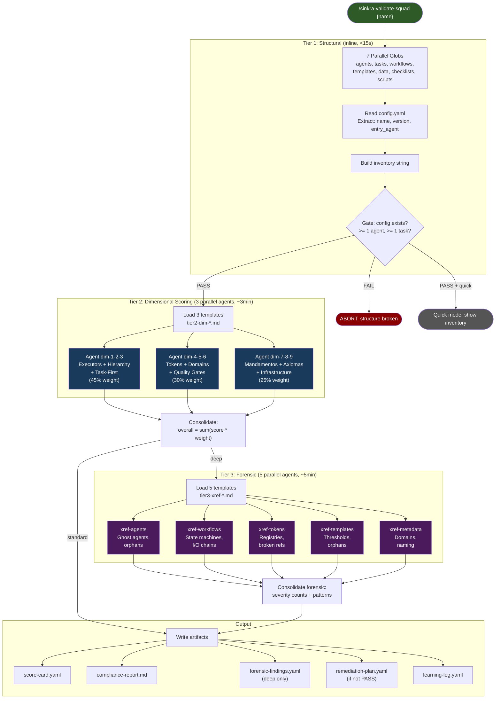
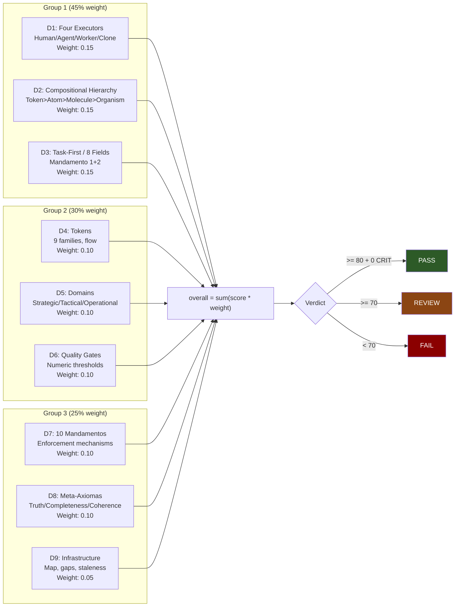
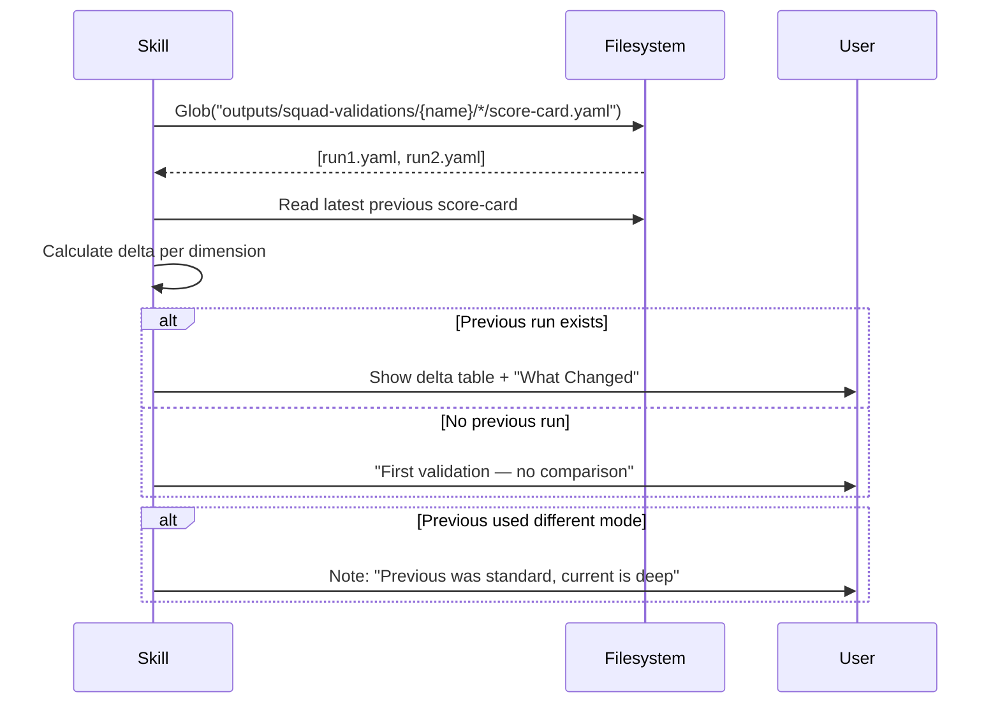
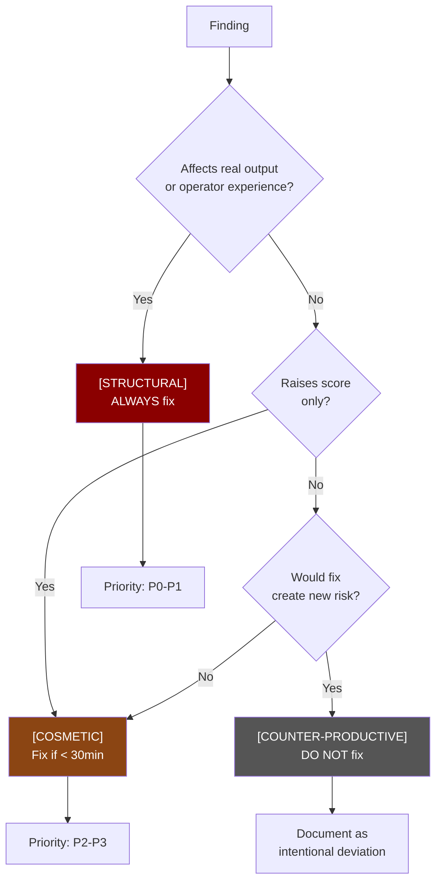
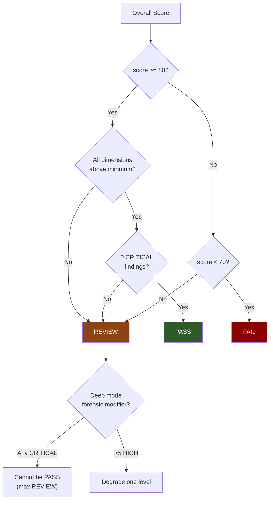
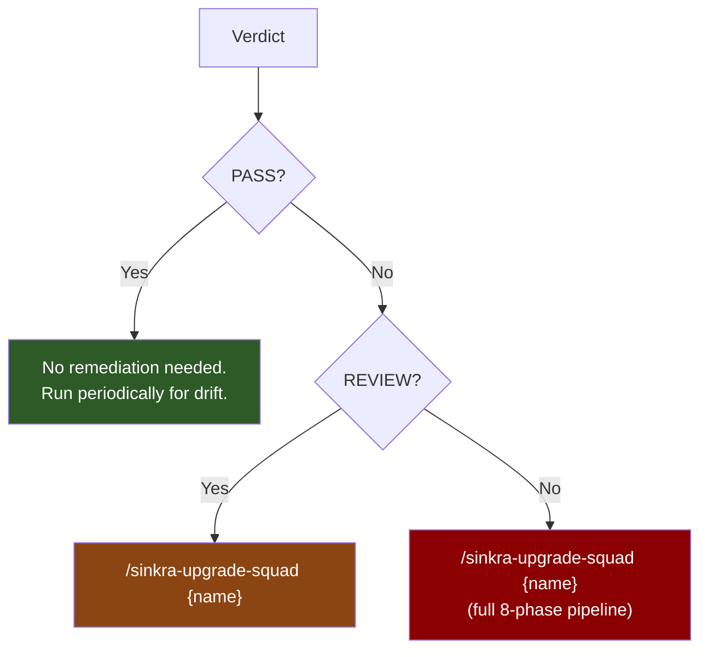
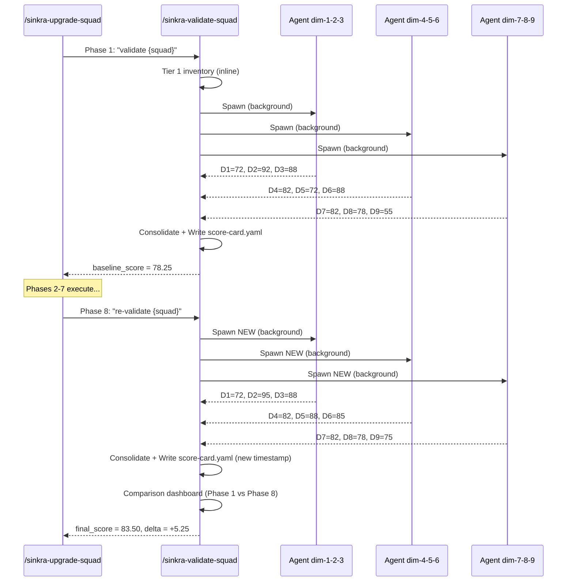

# /sinkra-validate-squad — 3-Tier SINKRA Squad Validation

Validates any squad against SINKRA methodology using progressive depth tiers: structural checks, 9-dimension LLM scoring, and forensic cross-reference investigation.

## Quick Start

```bash
/sinkra-validate-squad spy                 # Standard (Tier 1+2, ~3min)
/sinkra-validate-squad spy --deep          # Deep (Tier 1+2+3, ~10min)
/sinkra-validate-squad spy --quick         # Quick (Tier 1 only, <30s)
```

## 3-Tier Architecture



## 9 Dimensions (Tier 2)

Each dimension is scored 0-100 using countable facts, not subjective assessment.



## 5 Forensic Investigators (Tier 3)

Each investigator cross-references files against each other to find inconsistencies the dimension scoring misses.

```mermaid
graph TD
    subgraph "xref-agents"
        XA1["Task Agente field<br/>↔ actual agent files"]
        XA2["Config composition_mapping<br/>↔ filesystem"]
        XA3["Pipeline phases<br/>↔ agent assignments"]
        XA4["Task ID uniqueness"]
    end

    subgraph "xref-workflows"
        XW1["Workflow task_refs<br/>↔ task files"]
        XW2["Checkpoint names<br/>across config/workflow/chief"]
        XW3["Input/output chains<br/>between phases"]
        XW4["parallel_with vs<br/>depends_on contradictions"]
    end

    subgraph "xref-tokens"
        XR1["Token registry<br/>↔ config families"]
        XR2["Data files<br/>↔ instances.paths"]
        XR3["Ecosystem registry<br/>counts ↔ filesystem"]
        XR4["Cross-file path<br/>reference validity"]
    end

    subgraph "xref-templates"
        XT1["Template ↔ task<br/>references"]
        XT2["Checklist thresholds<br/>↔ config thresholds"]
        XT3["Output paths<br/>↔ artifact-classification"]
        XT4["Orphan scripts<br/>detection"]
    end

    subgraph "xref-metadata"
        XM1["Domain: metadata table<br/>↔ standalone line"]
        XM2["atomic_layer<br/>↔ composition_mapping"]
        XM3["8-field schema<br/>naming consistency"]
        XM4["Data file naming<br/>convention"]
    end

    XA1 --> FINDINGS["All findings merged<br/>Deduplicated by location<br/>Counted by severity"]
    XW1 --> FINDINGS
    XR1 --> FINDINGS
    XT1 --> FINDINGS
    XM1 --> FINDINGS

    FINDINGS --> PATTERNS["Structural Patterns<br/>Root cause diagnosis"]

    style FINDINGS fill:#8b4513,color:#fff
    style PATTERNS fill:#8b0000,color:#fff
```



## Comparison Dashboard (Phase 5.0)

Automatically detects previous validation runs and shows delta per dimension.



```
### Evolution (vs 2026-04-12 15:28)

| Dimension | Previous | Current | Delta | Trend |
|-----------|----------|---------|-------|-------|
| D1        | 72       | 72      | 0     | Stable |
| D5        | 72       | 88      | +16   | handoffs recognized |
| D9        | 55       | 75      | +20   | scoring calibration |
| Overall   | 78.25    | 83.50   | +5.25 | |
```

## Output Impact Classification

Every finding is tagged by real-world impact.



**Role-dependent classification:**
- **FRAMEWORK squads** (sinkra-squad): need ALL governance artifacts
- **GENERATOR squads** (squad-creator): need parseable constraints for output quality
- **OPERATIONAL squads** (spy, books): prose-based rules sufficient when consumed by LLM

## Scoring Methodology (Deterministic)

Scores derived from countable facts, not subjective assessment. Ensures ±3 point stability between runs.

```
Example scoring chain (D1 Four Executors):

  26 tasks total
  ├── 4 canonical types present:       +20 base
  ├── 0 Hybrid/varies:                 +20 (no violations)
  ├── Distribution: Agent=73% (>60%):  -10
  ├── Human=1, Clone=1 (under-rep):    -5
  └── Profile alignment: 24/26:        -3
  
  Score: 100 - 10 - 5 - 3 = 82
```

## Verdict Rules



**Per-dimension status labels:**

| Score vs Minimum | Status |
|------------------|--------|
| score >= minimum | PASS |
| minimum - 20 <= score < minimum | PARTIAL |
| score < minimum - 20 | BELOW FLOOR |
| score < 40 | CRITICAL |

## Next Steps (always displayed)



Always ends with a copy-paste command. Zero prose. Zero fatigue.

## When Called by /sinkra-upgrade-squad

The validate pipeline executes identically when called as Phase 1 or Phase 8 of the upgrade skill.



## Output Files

| File | Tiers | Description |
|------|-------|-------------|
| `score-card.yaml` | 1+2 | Scores, findings, verdict |
| `sinkra-compliance-report.md` | 2 | Human-readable report with tables |
| `forensic-findings.yaml` | 3 | Cross-ref inconsistencies (deep only) |
| `remediation-plan.yaml` | 2 | Wave-prioritized fix plan (if not PASS) |
| `learning-log.yaml` | all | Execution metadata with measured duration |

## Score Stability

```
Run-to-run delta on same squad (no file changes):
  Overall delta < 3: noise (ignore)
  Overall delta 3-10: likely real or calibration shift
  Overall delta > 10: investigate — scoring methodology drift
```

**Confidence calculation:**

| Condition | Confidence |
|-----------|-----------|
| No previous run | MEDIUM |
| delta <= 3 | HIGH |
| 3 < delta <= 8 | MEDIUM |
| delta > 8 | LOW |
| Different mode (standard vs deep) | MEDIUM |

## Results (tested squads)

| Squad | Tasks | Score | Verdict | Duration |
|-------|-------|-------|---------|----------|
| sinkra-squad | 26 | 83.50 | REVIEW | ~13min (deep) |
| squad-creator | 140 | 70.70 | FAIL | ~16min (deep) |
| spy | 42 | 64.25 | FAIL | ~13min (deep) |
| movement | 48 | 37.0 | FAIL | ~10min (standard) |

## Files

| File | Purpose |
|------|---------|
| `SKILL.md` | Skill definition (~780 lines) |
| `README.md` | This documentation |
| `squads/sinkra-squad/templates/validate-squad/tier2-dim-1-2-3.md` | Tier 2 scoring prompt (D1-D3) |
| `squads/sinkra-squad/templates/validate-squad/tier2-dim-4-5-6.md` | Tier 2 scoring prompt (D4-D6) |
| `squads/sinkra-squad/templates/validate-squad/tier2-dim-7-8-9.md` | Tier 2 scoring prompt (D7-D9) |
| `squads/sinkra-squad/templates/validate-squad/tier3-xref-agents-tasks-config.md` | Tier 3 investigator |
| `squads/sinkra-squad/templates/validate-squad/tier3-xref-workflows-checkpoints.md` | Tier 3 investigator |
| `squads/sinkra-squad/templates/validate-squad/tier3-xref-tokens-registries.md` | Tier 3 investigator |
| `squads/sinkra-squad/templates/validate-squad/tier3-xref-templates-scripts.md` | Tier 3 investigator |
| `squads/sinkra-squad/templates/validate-squad/tier3-xref-task-metadata.md` | Tier 3 investigator |
